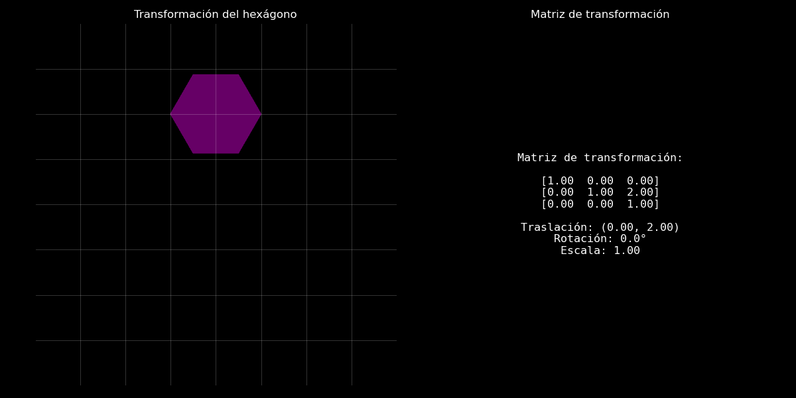
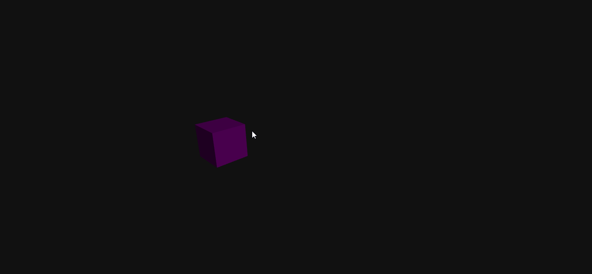
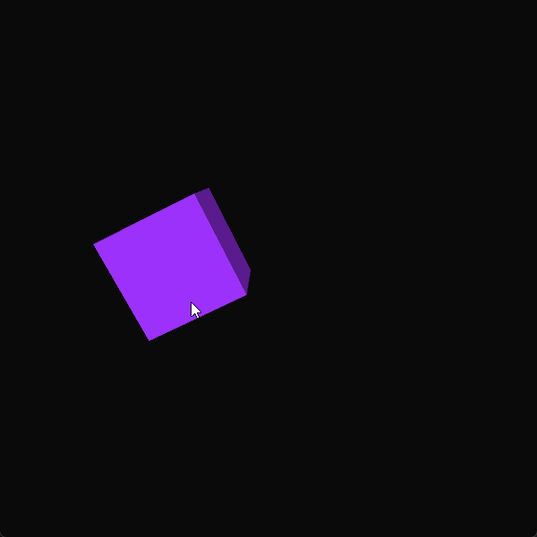

# 🧪 Taller 0 - Transformaciones Básicas en Computación Visual

## 🔍 Objetivo del Taller

Explorar los conceptos fundamentales de **transformaciones geométricas** (traslación, rotación y escala) en distintos entornos de programación visual.  
Cada estudiante debe crear un **"Hola Mundo Visual"** donde se muestre un objeto o escena básica y se le apliquen **transformaciones estáticas y animadas en función del tiempo**.

---

## 🧠 Conceptos Aprendidos

Lista los principales conceptos aplicados:

- Matrices de transformación para manipulación de objetos.
- Diferencia entre transformaciones estáticas y animadas.
- Animación de parámetros en función del tiempo o frame.
- Uso de funciones trigonométricas para trayectorias y escalados.
- Visualización de transformaciones en entornos gráficos.
- Exportación de animaciones como GIFs.
- Organización y documentación de proyectos de computación visual.

---

## 🔧 Herramientas y Entornos

- Python (matplotlib, numpy, imageio)
- Unity (C#, Unity Editor)
- Three.js / React Three Fiber (JavaScript, React, Vite)
- Processing (Java, Processing IDE)

---

## 📁 Estructura del Proyecto

```
2025-04-09_taller0_transformaciones/
├── processing/
├── python/
├── threejs/
├── README.md

```

---

## 🧪 Implementación

### 🔹 Etapas realizadas por tecnología

#### Python (matplotlib, numpy, imageio)

1. Creación de una figura geométrica básica (círculo).
2. Definición y aplicación de matrices de transformación (traslación, rotación, escala) en cada frame.
3. Animación de la figura en función del tiempo.
4. Visualización y exportación de la animación como GIF.

#### Three.js / React Three Fiber

1. Creación de un proyecto con Vite y React Three Fiber.
2. Agregado de un objeto 3D (mesh) a la escena.
3. Uso del hook `useFrame` para animar posición, rotación y escala.
4. Visualización en el navegador y captura de la animación como GIF.

#### Processing (Java)

1. Creación de un sketch y dibujo de una figura geométrica (rectángulo).
2. Aplicación de transformaciones animadas usando `translate()`, `rotate()`, `scale()` y funciones de tiempo.
3. Visualización de la animación en la ventana de Processing.
4. Exportación de frames o grabación de la animación como GIF.

---

### 🔹 Código relevante

A continuación se muestra un fragmento representativo de cómo se implementaron las transformaciones animadas en cada tecnología. El código aplica traslación, rotación y escala de manera dinámica sobre un objeto o figura:

#### Python (matplotlib, numpy, imageio)

Animación de una figura 2D aplicando matriz de transformación dependiente del tiempo:

```python
import numpy as np
import matplotlib.pyplot as plt

theta = np.linspace(0, 2*np.pi, 100)
x = np.cos(theta)
y = np.sin(theta)

for t in range(30):
    angle = np.radians(t * 12)
    scale = 1 + 0.5 * np.sin(t * 0.2)
    tx, ty = np.sin(t * 0.1), np.cos(t * 0.1)
    M = np.array([
        [scale * np.cos(angle), -scale * np.sin(angle)],
        [scale * np.sin(angle),  scale * np.cos(angle)]
    ])
    coords = np.dot(M, np.vstack([x, y]))
    plt.plot(coords[0] + tx, coords[1] + ty)
    plt.axis('equal')
    plt.axis('off')
    plt.pause(0.05)
    plt.clf()
```

#### Three.js / React Three Fiber (JavaScript)

Animación de posición, rotación y escala usando el hook `useFrame`:

```jsx
useFrame(({ clock }) => {
  const t = clock.getElapsedTime();
  mesh.position.x = Math.sin(t);
  mesh.rotation.y = t;
  mesh.scale.setScalar(1 + 0.5 * Math.sin(t));
});
```

#### Processing (Java)

Transformaciones animadas sobre un rectángulo en el centro de la pantalla:

```java
void draw() {
  background(255);
  float t = millis() / 1000.0;
  pushMatrix();
  translate(width/2 + 100*sin(t), height/2);
  rotate(t);
  float s = 1 + 0.5 * sin(t);
  scale(s);
  rectMode(CENTER);
  rect(0, 0, 100, 100);
  popMatrix();
}
```

---

## 📊 Resultados Visuales

A continuación se muestran los resultados visuales obtenidos en cada entorno.  
Cada GIF ilustra la animación de las transformaciones geométricas implementadas.

---

**Python (matplotlib, numpy, imageio):**  
Animación de un círculo sometido a traslación, rotación y escala en función del tiempo.



---

**Three.js / React Three Fiber:**  
Animación de un mesh 3D que recorre una trayectoria, rota y cambia de escala en el navegador.



---

**Processing (Java):**  
Animación de un rectángulo que se traslada, rota y escala de forma cíclica en la ventana de Processing.



## 🧩 Prompts Usados

Enumera los prompts utilizados:

```text
"Genera un GIF animado de una figura geométrica rotando y trasladándose usando Python y matplotlib"
"¿Cómo aplico matrices de transformación para animar un círculo en 2D?"
"¿Cómo puedo animar la posición, rotación y escala de un mesh en React Three Fiber?"
"¿Cómo sincronizo animaciones con el tiempo en Processing usando sin() y millis()?"
---

## 💬 Reflexión Final

Este taller me permitió comprender y aplicar de manera práctica los conceptos fundamentales de las transformaciones geométricas en computación visual. Reforcé el uso de matrices para manipular objetos y la importancia de animar parámetros en función del tiempo para lograr efectos visuales dinámicos. Además, pude comparar cómo se implementan estos conceptos en diferentes entornos y lenguajes, lo que amplió mi perspectiva sobre las herramientas disponibles para visualización y animación.

La parte más interesante fue ver cómo una misma idea matemática se traduce en código en tecnologías tan distintas como Python, Processing o Three.js. El mayor reto fue sincronizar correctamente las animaciones y exportar los resultados como GIFs, especialmente en entornos donde no es una función nativa. Para futuros proyectos, buscaría automatizar aún más la exportación de resultados y explorar la integración de interactividad en tiempo real.
---


## ✅ Checklist de Entrega

- [x] Carpeta `YYYY-MM-DD_nombre_taller`
- [x] Código limpio y funcional
- [x] GIF incluido con nombre descriptivo (si el taller lo requiere)
- [x] Visualizaciones o métricas exportadas
- [x] README completo y claro
- [x] Commits descriptivos en inglés
```
