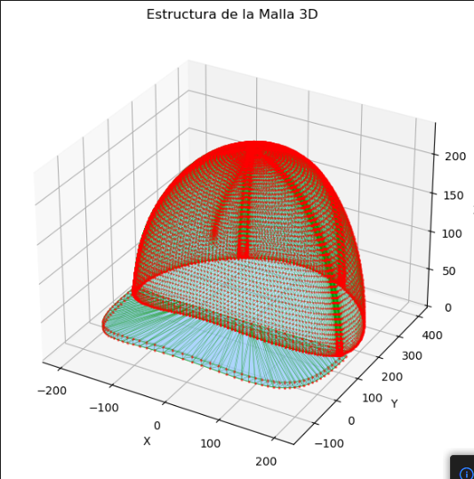
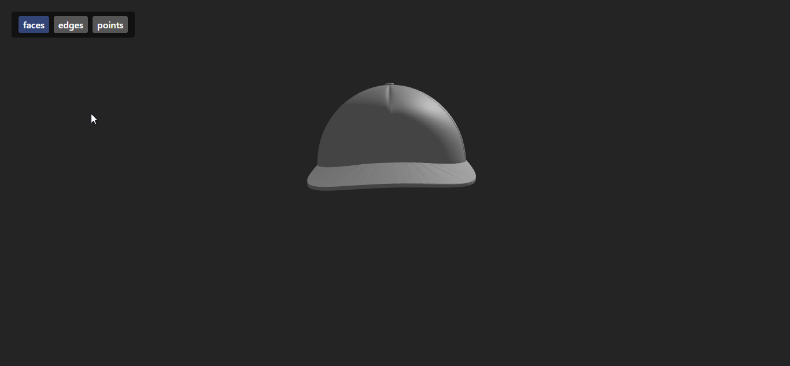

# 🧪 Taller - Construyendo el Mundo 3D: Vértices, Aristas y Caras

## 🔍 Objetivo del taller

Comprender las estructuras gráficas básicas que forman los modelos 3D (mallas poligonales) y visualizar su estructura en distintas plataformas. Se explorará la diferencia entre vértice, arista y cara, así como el contenido de formatos de archivo estándar de malla como `.OBJ`, `.STL` y `.GLTF`.

---

## 🧠 Conceptos Aprendidos

- Importación y visualización de modelos 3D (formato STL).
- Uso de Three.js y React Three Fiber para renderizado 3D en la web.
- Manipulación de escenas, cámaras y controles de órbita.
- Visualización y análisis de modelos 3D en Python.
- Diferencias entre representación por caras, aristas y puntos.
- Organización de proyectos de computación visual 3D.

---

## 🔧 Herramientas y Entornos

- **Three.js / React Three Fiber** (JavaScript, React, Vite)
- **Python** (Jupyter Notebook, numpy, matplotlib)
- **Modelos STL** (archivos en `/python/` y `/threejs/public/models/`)

---

## 📁 Estructura del Proyecto

```
 python/
   ├── Cap.stl
   └── importacionmodelo.ipynb
 threejs/
    ├── public/
    │   └── models/
    │       └── model.stl
    ├── src/
    │   ├── App.tsx
    │   ├── main.tsx
    │   └── ...
    ├── index.html
    ├── package.json
    └── ...
```

---

## 🧪 Implementación

### 🔹 Etapas realizadas por tecnología

#### Python (Jupyter Notebook)

1. Carga de archivos STL usando librerías de Python.
2. Visualización y análisis básico del modelo 3D.
3. Exploración de propiedades geométricas.

#### Three.js / React Three Fiber

1. Creación de un proyecto con Vite y React Three Fiber.
2. Importación de modelos STL usando `STLLoader`.
3. Visualización interactiva en el navegador con modos de caras, aristas y puntos.
4. Implementación de controles de cámara (`OrbitControls`).

---

### 🔹 Código relevante

#### Python

El siguiente fragmento muestra cómo cargar un archivo STL y visualizarlo en 3D utilizando Python. Se emplean las librerías `numpy`, `numpy-stl` y `matplotlib` para importar la malla, crear una figura tridimensional y mostrar la geometría del modelo STL de forma interactiva.

```python
# Cargar y visualizar STL en Python
import numpy as np
from stl import mesh
import matplotlib.pyplot as plt

your_mesh = mesh.Mesh.from_file('Cap.stl')
# Visualización básica
figure = plt.figure()
axes = figure.add_subplot(111, projection='3d')
axes.add_collection3d(Poly3DCollection(your_mesh.vectors))
plt.show()
```

#### Three.js / React Three Fiber

En este ejemplo se ilustra cómo renderizar un modelo STL en la web usando React Three Fiber (basado en Three.js). El componente `<STLModel />` carga el archivo STL y permite alternar entre diferentes modos de visualización (caras, aristas, puntos). Además, se incluyen controles de órbita para interactuar con la escena 3D desde el navegador.

```tsx
// Animación y visualización de STL en React Three Fiber
<Canvas>
  <Suspense fallback={null}>
    <STLModel url="/models/model.stl" mode={mode} />
  </Suspense>
  <OrbitControls />
</Canvas>
```

---

## 📊 Resultados Visuales

A continuación se presentan los resultados obtenidos al visualizar el modelo STL en cada tecnología, acompañados de una breve explicación y una ruta de ejemplo para las imágenes o GIFs.

### Python

La visualización en Python permite observar el modelo STL de forma estática o interactiva dentro de un Jupyter Notebook o ventana de matplotlib. Se pueden analizar detalles geométricos y la estructura de la malla.



---

### Three.js / React Three Fiber

En la web, la visualización es completamente interactiva. El usuario puede rotar, hacer zoom y alternar entre modos de visualización (caras, aristas, puntos) directamente desde el navegador, facilitando la exploración del modelo 3D.



---

---

## 🧩 Prompts Usados

```text
"¿Cómo cargo y visualizo un archivo STL en Python?"
"¿Cómo renderizo un modelo STL en Three.js con React Three Fiber?"
"¿Cómo alterno entre modos de visualización de caras, aristas y puntos en Three.js?"
```

---

## 💬 Reflexión Final

Con este taller reforcé mi comprensión sobre las estructuras fundamentales de los modelos 3D, como vértices, aristas y caras, y aprendí a manipular archivos STL en diferentes entornos. Pude comparar la facilidad de análisis geométrico en Python con la potencia de visualización interactiva que ofrece Three.js en la web. Además, entendí mejor cómo se organizan los proyectos de computación visual y la importancia de elegir la herramienta adecuada según el objetivo.

La parte más interesante fue lograr la visualización interactiva en el navegador, permitiendo alternar entre modos de visualización y manipular la cámara en tiempo real. También resultó desafiante entender el flujo de datos entre los distintos formatos y adaptar el código para que funcionara correctamente en cada plataforma.

En futuros proyectos, me gustaría profundizar en la optimización de la carga de modelos y explorar otros formatos como GLTF. Mejoraría la documentación del proceso y buscaría integrar análisis geométricos más avanzados directamente en la web, para aprovechar tanto la interactividad como el poder analítico en un solo entorno.

---
