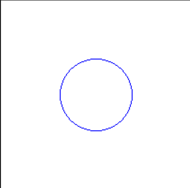
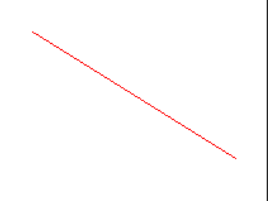
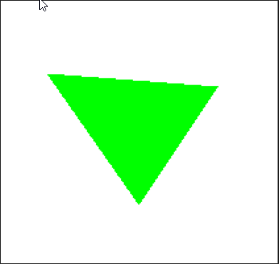

# 🧪 Taller - Rasterización desde Cero: Dibujando con Algoritmos Clásicos

## 🔍 Objetivo del taller

Comprender e implementar los **algoritmos clásicos de rasterización** para líneas, círculos y triángulos, entendiendo cómo se construyen imágenes píxel a píxel en una pantalla. El objetivo es desarrollar una base sólida sobre cómo se generan primitivas gráficas sin usar librerías de alto nivel.

---

## 🧠 Conceptos Aprendidos

- Algoritmo de Bresenham para rasterización de líneas.
- Rasterización de polígonos (relleno y contorno).
- Diferencias entre métodos incrementales y analíticos.

---

## 🔧 Herramientas y Entornos

- **Python** (Jupyter Notebook, NumPy, Matplotlib)
- **Jupyter Notebook** para experimentación y visualización interactiva.

---

## 📁 Estructura del Proyecto

```
 python/
│   └── solucion.ipynb
├── resultados/
├── README.md
```

---

## 🧪 Implementación

### 🔹 Etapas realizadas

1. Implementación del algoritmo de Bresenham para líneas.
2. Rasterización de polígonos simples (contorno y relleno).
3. Visualización de los resultados y comparación con métodos nativos de Matplotlib.
4. Exportación de imágenes y resultados a la carpeta `resultados/`.

---

### 🔹 Código relevante

#### Python (Jupyter Notebook)

Ejemplo representativo de la rasterización de una línea usando el algoritmo de Bresenham:

```python
import numpy as np
import matplotlib.pyplot as plt

def bresenham_line(x0, y0, x1, y1):
    points = []
    dx = abs(x1 - x0)
    dy = abs(y1 - y0)
    x, y = x0, y0
    sx = 1 if x0 < x1 else -1
    sy = 1 if y0 < y1 else -1
    if dx > dy:
        err = dx / 2.0
        while x != x1:
            points.append((x, y))
            err -= dy
            if err < 0:
                y += sy
                err += dx
            x += sx
    else:
        err = dy / 2.0
        while y != y1:
            points.append((x, y))
            err -= dx
            if err < 0:
                x += sx
                err += dy
            y += sy
    points.append((x, y))
    return points

# Visualización
line = bresenham_line(2, 2, 15, 10)
img = np.zeros((20, 20))
for x, y in line:
    img[y, x] = 1
plt.imshow(img, cmap='gray')
plt.title('Línea rasterizada (Bresenham)')
plt.show()
```

---

## 📊 Resultados Visuales

A continuación se muestran ejemplos de líneas y polígonos rasterizados utilizando los algoritmos implementados. Los resultados permiten comparar la precisión y eficiencia de cada método.





---

## 🧩 Prompts Usados

```text
"¿Cómo implemento el algoritmo de Bresenham para rasterizar líneas en Python?"
"¿Cómo rasterizo y relleno polígonos en una matriz de píxeles?"
"¿Cómo visualizo los resultados de rasterización en Matplotlib?"
```

---

## 💬 Reflexión Final

Con este taller reforcé mi comprensión sobre los fundamentos de la rasterización y la importancia de los algoritmos clásicos como el de Bresenham para la representación eficiente de primitivas geométricas en imágenes digitales. Aprendí a implementar estos algoritmos desde cero y a visualizar el proceso de conversión de coordenadas continuas a una matriz discreta de píxeles, lo que me permitió entender mejor cómo funcionan internamente las herramientas gráficas de alto nivel.

La parte más interesante y desafiante fue asegurar la correcta visualización de los resultados y manejar los casos borde en los algoritmos, especialmente al trabajar con diferentes orientaciones y tamaños de líneas y polígonos. Me resultó valioso comparar los resultados de mis implementaciones con los métodos nativos de Matplotlib, lo que me ayudó a identificar diferencias en precisión y eficiencia.

Para futuros proyectos, me gustaría explorar la rasterización de curvas y la optimización de los algoritmos para trabajar con resoluciones mayores. También mejoraría la documentación del proceso y buscaría integrar pruebas automáticas para validar los resultados de los algoritmos en distintos escenarios.
