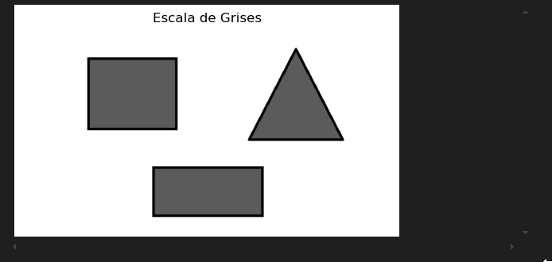
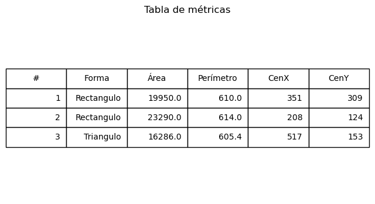

# 🧪 Taller - Análisis de Figuras Geométricas: Centroide, Área y Perímetro

## 🔍 Objetivo del taller

Detectar formas simples (círculos, cuadrados, triángulos) en imágenes binarizadas y calcular propiedades geométricas como área, perímetro y centroide. El objetivo es desarrollar habilidades para extraer métricas relevantes de contornos detectados en imágenes procesadas.

---

## 🧠 Conceptos Aprendidos

- Segmentación de figuras en imágenes.
- Cálculo de métricas geométricas (área, perímetro, compacidad, etc.).
- Extracción y análisis de contornos.
- Visualización de resultados y métricas sobre la imagen original.
- Organización y documentación de proyectos de análisis geométrico.

---

## 🔧 Herramientas y Entornos

- **Python** (Jupyter Notebook, OpenCV, NumPy, Matplotlib)
- **OpenCV** para procesamiento y análisis de imágenes.
- **Jupyter Notebook** para experimentación y visualización interactiva.

---

## 📁 Estructura del Proyecto

```
python/
├── FormasNuevas.jpg
├── solucion.py
├── solucuon.ipynb
├── tabla_metrica.png
resultados/
README.md
```

---

## 🧪 Implementación

### 🔹 Etapas realizadas

1. Carga y preprocesamiento de la imagen con figuras geométricas.
2. Segmentación de las figuras mediante umbralización y operaciones morfológicas.
3. Extracción de contornos y cálculo de métricas geométricas para cada figura.
4. Visualización de los resultados y anotación de métricas sobre la imagen.
5. Generación de una tabla resumen con las métricas obtenidas.

---

### 🔹 Código relevante

#### Python

Fragmento representativo del análisis de figuras y cálculo de métricas:

```python
import cv2
import numpy as np
import matplotlib.pyplot as plt

# Cargar imagen
img = cv2.imread('FormasNuevas.jpg')
gray = cv2.cvtColor(img, cv2.COLOR_BGR2GRAY)
_, binary = cv2.threshold(gray, 127, 255, cv2.THRESH_BINARY_INV)

# Encontrar contornos
contours, _ = cv2.findContours(binary, cv2.RETR_EXTERNAL, cv2.CHAIN_APPROX_SIMPLE)

# Calcular métricas para cada figura
for cnt in contours:
    area = cv2.contourArea(cnt)
    perimeter = cv2.arcLength(cnt, True)
    compactness = (perimeter ** 2) / (4 * np.pi * area) if area > 0 else 0
    # Dibujar contorno y mostrar métricas
    cv2.drawContours(img, [cnt], -1, (0,255,0), 2)
    # ... (anotar métricas en la imagen)
plt.imshow(cv2.cvtColor(img, cv2.COLOR_BGR2RGB))
plt.axis('off')
plt.show()
```

---

## 📊 Resultados Visuales

A continuación se presentan los resultados obtenidos al analizar las figuras geométricas, incluyendo la visualización de los contornos y la tabla de métricas calculadas.

### Imagen Original y Contornos



### Tabla de Métricas



---

## 🧩 Prompts Usados

```text
"¿Cómo segmentar y calcular métricas de figuras geométricas en una imagen usando OpenCV?"
"¿Cómo extraer área, perímetro y compacidad de contornos en Python?"
"¿Cómo visualizar y anotar métricas sobre la imagen original?"
```

---

## 💬 Reflexión Final

Este taller me permitió comprender cómo analizar cuantitativamente figuras geométricas en imágenes y cómo utilizar OpenCV para extraer y visualizar métricas relevantes. Aprendí a combinar técnicas de segmentación, extracción de contornos y cálculo de descriptores para caracterizar objetos de manera eficiente. El mayor reto fue ajustar los parámetros de segmentación para obtener contornos precisos y organizar los resultados de forma clara en tablas y visualizaciones.

En futuros proyectos, me gustaría explorar métricas más avanzadas y aplicar estos métodos a conjuntos de datos más complejos o imágenes reales, así como automatizar la generación de reportes y visualizaciones.

---
