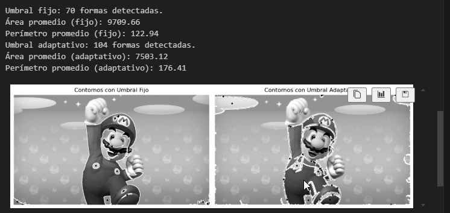

# 🧪 Taller - Segmentando el Mundo: Binarización y Reconocimiento de Formas

## 🔍 Objetivo del taller

Aplicar técnicas básicas de segmentación en imágenes mediante umbralización y detección de formas simples. El objetivo es comprender cómo identificar regiones de interés en imágenes mediante procesos de binarización y análisis morfológico.

---

## 🧠 Conceptos Aprendidos

- Umbralización y binarización de imágenes.
- Operaciones morfológicas (erosión, dilatación, apertura, cierre).
- Detección y etiquetado de regiones conectadas.
- Extracción de contornos y análisis de formas.
- Visualización de resultados con Matplotlib.
- Organización y documentación de proyectos de computación visual.

---

## 🔧 Herramientas y Entornos

- Python (Jupyter Notebook, OpenCV, NumPy, Matplotlib)
- OpenCV para procesamiento y segmentación de imágenes.

---

## 📁 Estructura del Proyecto

```
 python/
│   ├── mario.jpg
│   └── solucion.ipynb
├── README.md
```

---

## 🧪 Implementación

### 🔹 Etapas realizadas

1. **Carga y preprocesamiento de imágenes:** Se carga una imagen y se convierte a escala de grises, aplicando suavizado si es necesario.
2. **Umbralización:** Se aplica un umbral para binarizar la imagen y separar las formas del fondo.
3. **Operaciones morfológicas:** Se utilizan operaciones como erosión y dilatación para limpiar la segmentación.
4. **Detección de regiones y contornos:** Se identifican las regiones conectadas y se extraen los contornos de las formas segmentadas.
5. **Visualización:** Se muestran los resultados de cada etapa usando Matplotlib para comparar el efecto de cada técnica.

---

### 🔹 Código relevante

Fragmento representativo de la segmentación y extracción de formas:

```python
import cv2
import numpy as np
import matplotlib.pyplot as plt

# Cargar imagen
img = cv2.imread('mario.jpg')
gray = cv2.cvtColor(img, cv2.COLOR_BGR2GRAY)

# Suavizado
blur = cv2.GaussianBlur(gray, (5, 5), 0)

# Umbralización
_, binary = cv2.threshold(blur, 120, 255, cv2.THRESH_BINARY_INV)

# Operaciones morfológicas
kernel = np.ones((3, 3), np.uint8)
opened = cv2.morphologyEx(binary, cv2.MORPH_OPEN, kernel, iterations=2)

# Encontrar contornos
contours, _ = cv2.findContours(opened, cv2.RETR_EXTERNAL, cv2.CHAIN_APPROX_SIMPLE)

# Dibujar contornos sobre la imagen original
output = img.copy()
cv2.drawContours(output, contours, -1, (0, 255, 0), 2)

# Visualización
plt.figure(figsize=(12, 4))
plt.subplot(1, 3, 1)
plt.title('Original')
plt.imshow(cv2.cvtColor(img, cv2.COLOR_BGR2RGB))
plt.axis('off')
plt.subplot(1, 3, 2)
plt.title('Segmentada')
plt.imshow(opened, cmap='gray')
plt.axis('off')
plt.subplot(1, 3, 3)
plt.title('Contornos')
plt.imshow(cv2.cvtColor(output, cv2.COLOR_BGR2RGB))
plt.axis('off')
plt.tight_layout()
plt.show()
```

---

## 📊 Resultados Visuales

A continuación se muestran los resultados visuales obtenidos en cada etapa.  
Cada imagen ilustra el proceso de segmentación y la extracción de formas en la imagen de entrada.

## 

## 🧩 Prompts Usados

```text
"¿Cómo segmento formas en una imagen usando OpenCV?"
"¿Cómo aplico operaciones morfológicas para limpiar una segmentación?"
"¿Cómo extraigo y dibujo contornos de objetos segmentados en Python?"
```

---

## 💬 Reflexión Final

Este taller me permitió comprender y aplicar técnicas básicas de segmentación de formas en imágenes digitales. Aprendí a combinar preprocesamiento, umbralización y operaciones morfológicas para mejorar la calidad de la segmentación y a extraer información relevante mediante la detección de contornos. La visualización de cada etapa facilitó el análisis del proceso y el ajuste de parámetros para obtener mejores resultados.

Para futuros proyectos, me gustaría explorar métodos de segmentación más avanzados, como el uso de algoritmos de clustering o aprendizaje automático, y aplicar estas técnicas a conjuntos de imágenes más complejos o en tiempo real.
