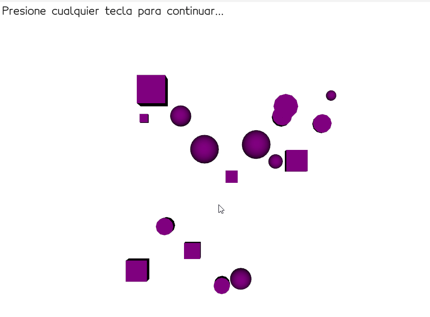

# 🧪 Taller - Escenas Paramétricas: Creación de Objetos desde Datos

## 🔍 Objetivo del taller

Generar objetos 3D de manera programada a partir de listas de coordenadas o datos estructurados. El propósito es entender cómo crear geometría en tiempo real y de forma flexible mediante código, utilizando bucles, estructuras condicionales y exportando o renderizando las escenas generadas.

---

## 🧠 Conceptos Aprendidos

- Generación y manipulación de geometría básica en 3D (caja, esfera, cono).
- Uso de React Three Fiber para renderizado 3D interactivo en la web.
- Implementación de controles paramétricos en tiempo real con Leva.
- Agrupación y jerarquía de objetos para animaciones colectivas.
- Animación de transformaciones (rotación, escala) usando hooks de React.
- Organización y documentación de proyectos de computación visual interactiva.

---

## 🔧 Herramientas y Entornos

- **React Three Fiber** (JavaScript, React, Vite)
- **Leva** para controles de parámetros interactivos
- **Python** (para generación/exportación de modelos 3D)
- **Modelos OBJ/STL/GLB** (archivos en `/python/resultados_modificados/`)

---

## 📁 Estructura del Proyecto

```
python/
├── solucion.py
├── resultados_modificados/
│   ├── basic_shapes_object_0.obj
│   ├── basic_shapes_object_0.stl
│   ├── basic_shapes_object_1.obj
│   ├── basic_shapes_object_1.stl
│   ├── basic_shapes_object_2.obj
│   ├── basic_shapes_object_2.stl
│   ├── basic_shapes_trimesh.glb
│   ├── basic_shapes_trimesh.obj
│   ├── basic_shapes_trimesh.stl
│   ├── basic_shapes_vedo.glb.npy
│   ├── basic_shapes_vedo.obj.npy
│   ├── basic_shapes_vedo.stl.npy
│   └── ...
threejs/
└── my-threejs-app/
    ├── src/
    │   ├── Scene.jsx
    │   └── ...
    ├── public/
    ├── package.json
    └── ...
Resultados/
├── resultadopy.gif
└── resultadothree.gif
README.md
```

---

## 🧪 Implementación

### 🔹 Etapas realizadas por tecnología

#### Python

1. Generación de modelos 3D básicos y exportación en formatos OBJ/STL/GLB.
2. Visualización y análisis de las formas generadas.
3. Exportación de resultados para uso en la web.

#### React Three Fiber

1. Creación de una escena 3D interactiva con Vite y React Three Fiber.
2. Definición de una lista de objetos paramétricos (caja, esfera, cono) y sus propiedades.
3. Implementación de controles en tiempo real con Leva para modificar escala, color y animación.
4. Agrupación de objetos y animación colectiva mediante rotación del grupo.
5. Renderizado interactivo en el navegador.

---

### 🔹 Código relevante

#### Python

Fragmento para exportar modelos 3D básicos (ver `/python/solucion.py`):

```python
# Ejemplo de exportación de una caja en formato STL
import trimesh

caja = trimesh.creation.box(extents=(1, 1, 1))
caja.export('resultados_modificados/basic_shapes_object_0.stl')
```

#### React Three Fiber

Fragmento representativo de la escena interactiva (ver [`Scene.jsx`](threejs/my-threejs-app/src/Scene.jsx)):

```jsx
import React, { useRef } from "react";
import { useFrame } from "@react-three/fiber";
import { useControls } from "leva";

function EscenaInteractiva() {
  const { escalaGlobal, colorCaja, rotarGrupo, velocidadRotacion } =
    useControls({
      escalaGlobal: { value: 1, min: 0.1, max: 3, step: 0.1 },
      colorCaja: "#ff0000",
      rotarGrupo: true,
      velocidadRotacion: { value: 0.01, min: 0, max: 0.1, step: 0.005 },
    });
  const referenciaGrupo = useRef();
  useFrame(() => {
    if (rotarGrupo && referenciaGrupo.current) {
      referenciaGrupo.current.rotation.y += velocidadRotacion;
    }
  });
  const listaObjetos = [
    {
      id: "objeto1",
      tipo: "caja",
      posicion: [-2, 0, 0],
      escala: [1, 1, 1],
      color: colorCaja,
      rotacion: [0, 0, 0],
    },
    {
      id: "objeto2",
      tipo: "esfera",
      posicion: [2, 0, 0],
      escala: [1.5, 1.5, 1.5],
      color: "#00ff00",
      rotacion: [0, 0, 0],
    },
    {
      id: "objeto3",
      tipo: "cono",
      posicion: [0, 2, 0],
      escala: [1, 2, 1],
      color: "#0000ff",
      rotacion: [0, 0, 0],
    },
  ];
  return (
    <group ref={referenciaGrupo}>
      {listaObjetos.map((objeto) => (
        <mesh
          key={objeto.id}
          position={objeto.posicion}
          scale={objeto.escala.map((valor) => valor * escalaGlobal)}
          rotation={objeto.rotacion}
        >
          {objeto.tipo === "caja" && <boxGeometry args={[1, 1, 1]} />}
          {objeto.tipo === "esfera" && <sphereGeometry args={[1, 32, 32]} />}
          {objeto.tipo === "cono" && <coneGeometry args={[1, 2, 32]} />}
          <meshStandardMaterial color={objeto.color} />
        </mesh>
      ))}
    </group>
  );
}
```

---

## 📊 Resultados Visuales

A continuación se muestran ejemplos de visualización de la escena paramétrica y los modelos generados.

### Python

Visualización de las formas básicas generadas y exportadas:



---

### React Three Fiber

Escena interactiva con controles de parámetros y animación en tiempo real:


---

## 🧩 Prompts Usados

```text
"¿Cómo genero y exporto modelos 3D básicos en Python?"
"¿Cómo creo una escena paramétrica interactiva en React Three Fiber?"
"¿Cómo uso Leva para modificar parámetros de objetos 3D en tiempo real?"
"¿Cómo agrupo y animo varios objetos en una escena 3D?"
```

---

## 💬 Reflexión Final

Este taller permitió experimentar con la generación y manipulación de escenas 3D tanto desde Python como desde la web. La integración de controles interactivos con Leva facilitó la exploración de parámetros y la visualización inmediata de los cambios. El mayor reto fue coordinar la exportación de modelos y la sincronización de animaciones grupales. Para futuros proyectos, sería interesante incorporar la carga dinámica de modelos externos y explorar la interacción avanzada entre objetos en la escena.

---
