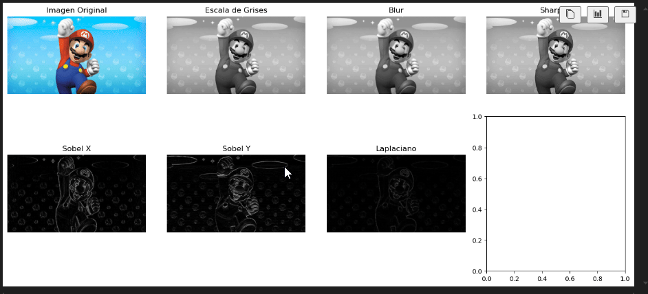

# 🧪 Taller - Ojos Digitales: Introducción a la Visión Artificial

## 🔍 Objetivo del taller

Entender los fundamentos de la percepción visual artificial mediante imágenes en escala de grises, filtros y detección básica de bordes. Se trabajará con OpenCV para explorar cómo los computadores interpretan imágenes visuales básicas.

---

## 🧠 Conceptos Aprendidos

- Conversión de imágenes a escala de grises.
- Aplicación de filtros convolucionales: blur gaussiano y sharpening.
- Detección de bordes con operadores Sobel y Laplaciano.
- Visualización de resultados con Matplotlib.
- Procesamiento de video en tiempo real desde la webcam.
- Organización y documentación de proyectos de computación visual.

---

## 🔧 Herramientas y Entornos

- **Python** (Jupyter Notebook, OpenCV, NumPy, Matplotlib)
- **OpenCV** para procesamiento de imágenes y video.
- **Jupyter Notebook** para experimentación y visualización interactiva.

---

## 📁 Estructura del Proyecto

```
└── python/
    ├── mario.jpg
    ├── ojosdigitales.ipynb
    └── prueba.py
```

---

## 🧪 Implementación

### 🔹 Etapas realizadas

1. **Carga y preprocesamiento de imágenes:** Se carga una imagen a color y se convierte a escala de grises.
2. **Aplicación de filtros convolucionales:** Se aplican filtros de suavizado (blur gaussiano) y de realce (sharpening) para modificar la apariencia de la imagen.
3. **Detección de bordes:** Se utilizan los operadores Sobel (en X e Y) y Laplaciano para resaltar los contornos y detalles de la imagen.
4. **Visualización:** Los resultados de cada etapa se muestran en una cuadrícula usando Matplotlib para comparar los efectos de cada filtro.
5. **Procesamiento en tiempo real:** Se implementa la captura de video desde la webcam, aplicando detección de bordes en vivo y mostrando el resultado en una ventana.
6. **Interactividad:** Se agregan sliders (trackbars) en OpenCV para ajustar en tiempo real los parámetros de los filtros y observar su efecto inmediato.

---

### 🔹 Código relevante

#### Python (OpenCV, Matplotlib)

Fragmento representativo de la aplicación de filtros y detección de bordes:

```python
import cv2
import numpy as np
import matplotlib.pyplot as plt

# Cargar imagen
img_color = cv2.imread('mario.jpg')
img_gray = cv2.cvtColor(img_color, cv2.COLOR_BGR2GRAY)

# Filtros
blur = cv2.GaussianBlur(img_gray, (5,5), 0)
kernel_sharp = np.array([[0, -1, 0], [-1, 5, -1], [0, -1, 0]])
sharpen = cv2.filter2D(img_gray, -1, kernel_sharp)

# Bordes
sobelx = cv2.Sobel(img_gray, cv2.CV_64F, 1, 0, ksize=3)
sobely = cv2.Sobel(img_gray, cv2.CV_64F, 0, 1, ksize=3)
laplacian = cv2.Laplacian(img_gray, cv2.CV_64F)

# Visualización
fig, axes = plt.subplots(2, 4, figsize=(14, 7))
images = [cv2.cvtColor(img_color, cv2.COLOR_BGR2RGB), img_gray, blur, sharpen, sobelx, sobely, laplacian]
titles = ['Color', 'Grayscale', 'Blur', 'Sharpen', 'Sobel X', 'Sobel Y', 'Laplacian']
for ax, im, t in zip(axes.flatten(), images, titles):
    ax.imshow(im if im.ndim == 3 else im, cmap=('gray' if im.ndim==2 else None))
    ax.set_title(t)
    ax.axis('off')
axes.flatten()[-1].axis('off')
plt.tight_layout()
plt.show()
```

#### Procesamiento en tiempo real (Webcam)

```python
import cv2

cap = cv2.VideoCapture(0)
while True:
    ret, frame = cap.read()
    if not ret:
        break
    gray = cv2.cvtColor(frame, cv2.COLOR_BGR2GRAY)
    edges = cv2.Canny(gray, 50, 150)
    cv2.imshow("Webcam - Bordes", edges)
    if cv2.waitKey(1) & 0xFF == ord('q'):
        break
cap.release()
cv2.destroyAllWindows()
```

---

## 📊 Resultados Visuales

Se obtuvieron imágenes procesadas que muestran claramente el efecto de cada filtro y operador de bordes. Además, la detección de bordes en tiempo real permite visualizar los contornos de objetos capturados por la webcam, demostrando la potencia de OpenCV para aplicaciones interactivas.



---

## 🧩 Prompts Usados

```text
"¿Cómo aplico filtros convolucionales y detección de bordes en OpenCV?"
"¿Cómo visualizo los resultados de varios filtros en una cuadrícula con Matplotlib?"
"¿Cómo hago detección de bordes en tiempo real usando la webcam en Python?"
"¿Cómo agrego sliders para ajustar parámetros de filtros en OpenCV?"
```

---

## 💬 Reflexión Final

Este taller me permitió reforzar mis conocimientos sobre el procesamiento digital de imágenes, especialmente en la aplicación de filtros y técnicas de detección de bordes utilizando OpenCV. Aprendí a combinar diferentes operadores y a visualizar sus efectos de manera clara, lo que me ayudó a comprender mejor cómo se extraen características relevantes de una imagen para tareas de visión artificial.

La parte más interesante fue implementar el procesamiento en tiempo real con la webcam y observar cómo los filtros y detectores de bordes responden dinámicamente a los cambios en la escena. Ajustar los parámetros mediante sliders interactivos también resultó desafiante y enriquecedor, ya que permitió experimentar de forma inmediata con los efectos de cada filtro.

Para futuros proyectos, me gustaría explorar técnicas más avanzadas de procesamiento, como la detección de objetos o el seguimiento de movimiento. Mejoraría la interfaz de usuario para hacerla más intuitiva y buscaría integrar la exportación automática de resultados, así como documentar mejor el flujo de trabajo para facilitar la reproducibilidad y el aprendizaje de otros estudiantes.
