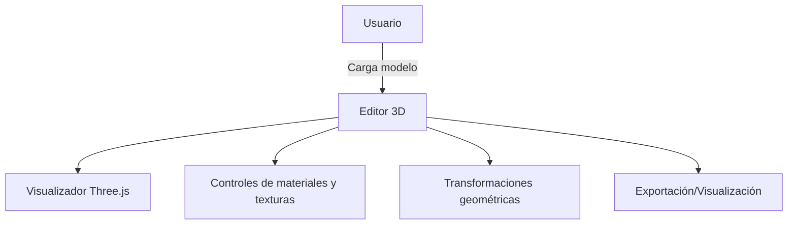
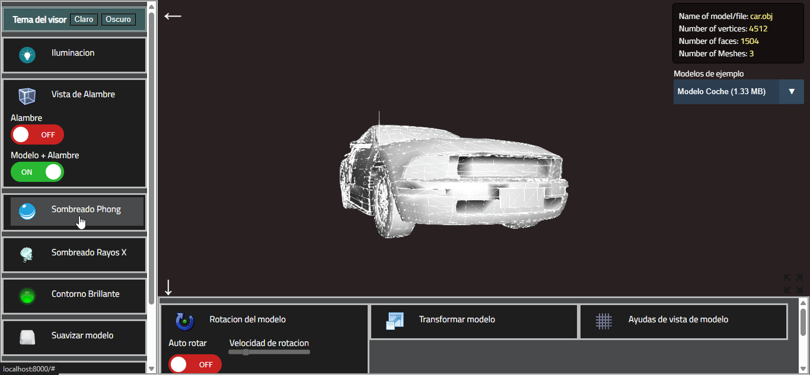
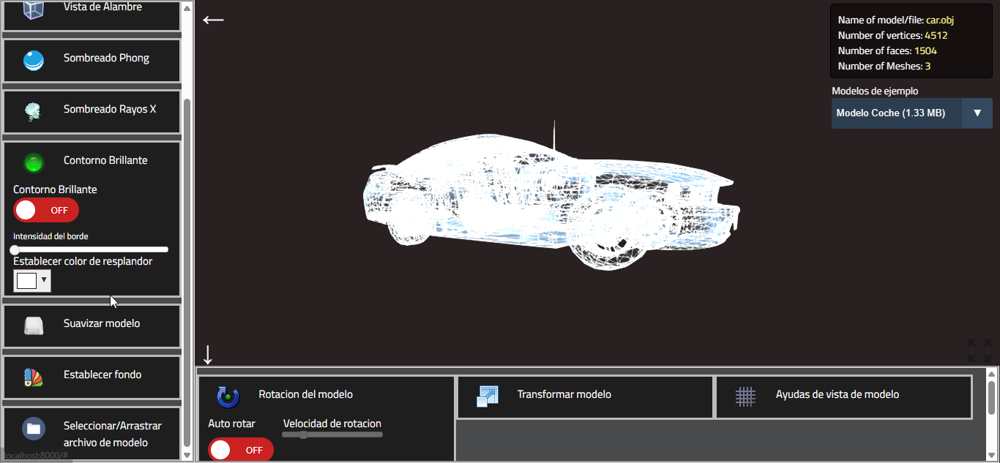
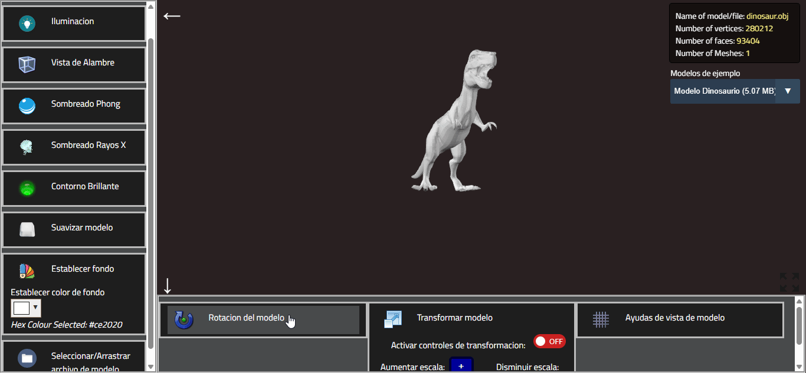

# 3D Model Editor - Informe

## Datos del Estudiante

- **Nombre completo:** Justin Brad Rodriguez Sanchez
- **Número de documento:** 1000790878
- **Correo institucional:** jusrodriguez@unal.edu.com

---

## Introducción del problema y contexto

El problema a resolver consiste en desarrollar una herramienta interactiva que permita visualizar modelos 3D en tiempo real, con funcionalidades para modificar materiales y texturas, realizar transformaciones geométricas y controlar la visualización del modelo en función de los parámetros definidos por el usuario. Este tipo de soluciones son útiles en una variedad de campos, como el diseño industrial, la visualización arquitectónica, y los videojuegos, donde los usuarios necesitan manipular y observar los modelos 3D de manera detallada.

La computación visual juega un rol fundamental en este tipo de aplicaciones, ya que permite una representación interactiva y dinámica de modelos 3D. El trabajo con modelos 3D requiere de herramientas eficientes que no solo permitan la manipulación de geometría, sino que también hagan posible una edición rápida y en tiempo real de sus propiedades visuales, como texturas y materiales. Esta habilidad de interactuar con los modelos de manera efectiva es esencial para mejorar el flujo de trabajo en industrias de diseño, entretenimiento y simulación.

---

## Justificacion de la solucion

La solución propuesta es un visualizador de modelos 3D interactivo que integra herramientas para manipular diferentes aspectos del modelo en tiempo real, tales como materiales, texturas, y geometría. Con este enfoque, el usuario puede ver el efecto de sus acciones inmediatamente, lo que mejora la comprensión visual de los cambios realizados. Además, la solución permite una visualización detallada de los modelos y su modificación mediante controles simples.

Este tipo de aplicación es relevante desde la perspectiva de la computación visual porque permite experimentar con los principios fundamentales de la representación tridimensional, la interacción con modelos 3D y la simulación de efectos de materiales y texturas en tiempo real. La integración de controles visuales y de materialización también abre un camino para desarrollos futuros en aplicaciones interactivas y experiencias inmersivas.

---

## Talleres Utilizados y su Rol

A continuación, se presentan los cinco talleres seleccionados que fueron integrados en la solución, así como su rol y las técnicas aplicadas:

- **Taller - Materiales Realistas: Introducción a PBR en Unity y Three.js-**

Rol: Este taller fue utilizado para aplicar técnicas de renderizado basado en física (PBR) en el modelo 3D. A través de materiales como roughnessMap, metalnessMap y normalMap, se logró simular materiales realistas que afectan la luz y la textura de los objetos en la escena.

- **Taller - Importando el Mundo: Visualización y Conversión de Formatos 3D**

Rol: Este taller facilitó la carga de modelos en diferentes formatos (.OBJ, .STL, .GLTF) y su conversión, lo que permite al sistema manejar varios tipos de archivos para visualizar el modelo correctamente.

- **Taller - UV Mapping: Texturas que Encajan**

Rol: Utilizamos las técnicas de mapeo UV para aplicar texturas sin distorsión a los modelos. Esto permite que las texturas se ajusten correctamente a la geometría del modelo 3D.

- **Taller - Dashboards Visuales 3D: Sliders y Botones para Controlar Escenas**

Rol: Este taller fue clave para desarrollar la interfaz de usuario del editor, que incluye botones y sliders para permitir la modificación en tiempo real de las texturas y los materiales del modelo.

- **Taller - Escenas Paramétricas: Creación de Objetos desde Datos**

Rol: A través de este taller, se aplicaron técnicas de creación de geometría parametrizada, lo que permitió que el sistema pueda generar y modificar modelos en función de parámetros definidos dinámicamente.

---

## Diagrama de Funcionamiento

A continuación se presenta el diagrama general de funcionamiento del editor de modelos 3D:

---

## Evidencia de Funcionamiento

A continuación se muestran GIFs animados que evidencian el funcionamiento de la herramienta:

---

## Enlace al Video

Puedes ver el video demostrativo del funcionamiento en el siguiente enlace:  
[Enlace al video](https://drive.google.com/file/d/1oo9sPaIhXFzKWPILDIepl7tm1i0Fcj_B/view?usp=sharing)

---

## Explicación Técnica del Funcionamiento

El editor de modelos 3D está construido sobre la biblioteca Three.js, lo que permite renderizar y manipular modelos tridimensionales en tiempo real dentro del navegador. El sistema soporta la carga de diferentes formatos de modelos (.OBJ, .STL, .GLTF) y permite aplicar materiales PBR para lograr efectos visuales realistas.

La interfaz de usuario incluye controles para modificar parámetros de materiales, texturas y geometría del modelo. Los sliders y botones permiten ajustar propiedades como color, brillo, rugosidad y metalicidad, así como realizar transformaciones geométricas (escala, rotación, traslación).

El sistema también integra técnicas de mapeo UV para asegurar que las texturas se ajusten correctamente a la geometría del modelo. Además, se implementan controles para la visualización de ayudas como cuadrículas, ejes y cajas delimitadoras, facilitando la orientación y manipulación del modelo en el espacio 3D.

---

## Conclusiones y Reflexiones Personales

El desarrollo de este editor de modelos 3D permitió profundizar en conceptos clave de la computación visual y la representación tridimensional. La integración de diferentes talleres y técnicas resultó fundamental para lograr una herramienta robusta y flexible.

La posibilidad de manipular modelos en tiempo real y observar los efectos de los cambios de materiales y texturas aporta un gran valor en áreas como el diseño, la simulación y la educación. Personalmente, considero que este proyecto es una base sólida para futuras mejoras, como la integración de animaciones avanzadas, exportación de modelos editados y compatibilidad con más formatos.

La experiencia adquirida en el manejo de Three.js y la implementación de interfaces interactivas será de gran utilidad en el desarrollo de aplicaciones visuales más complejas en el

## Referencias

A continuación se presentan las fuentes y materiales consultados para el desarrollo del proyecto, así como documentación y recursos utilizados durante el proceso.

- https://www.youtube.com/watch?v=n8lSebuDr6c
- https://www.youtube.com/watch?v=hiN75-q2Vvw
- https://github.com/Adjam93/threejs-model-viewer
- https://github.com/n1k02/three-js-projects
- https://community.haxe.org/t/three-js-starter-project/3412
